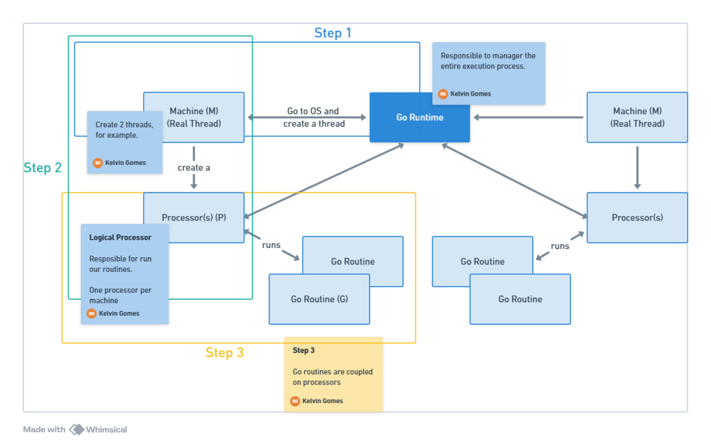

# Go Runtime Architecture

## Introduction

The Go runtime is the core of the Go programming language. It all code that manages the execution of Go programs. It is responsible for managing memory allocation, garbage collection, stack management, goroutine scheduling, and more.

## Components

- **Go Routines**: Go Routines are lightweight threads managed by the Go runtime. They are used to execute functions concurrently.
- **Scheduler**: The scheduler is responsible for managing the execution of go routines on the available CPUs.
- **Channels**: Channels are used to communicate between go routines.
- **Memory Allocator**: The memory allocator is responsible for managing memory allocation and garbage collection.
- **Garbage Collector**: The garbage collector is responsible for freeing up memory that is no longer in use.
- **Stack Management**: The stack management is responsible for managing the stack of each go routine.
- **Network Poller**: The network poller is responsible for managing network I/O operations.
- **Reflection**: The reflection is responsible for providing runtime type information.

## M:N Model

First of all, we have virtual threads (M) and real threads (N).

Virtual threads are threads created by the Go runtime (go routines), and real threads are threads created by the operating system.

Go runtime creates a number of virtual threads and manages them by itself. Then, it's not necessary to call the OS to create a new thread every time we need to run a new go routine.

This approach allow us to save memory and time, because we don't need to create a new thread every time we need to run a new go routine.

## Go Routines

Go routines are lightweight threads managed by the Go runtime. They are used to execute functions concurrently.

Create a go routine is cheaper than create a new thread, just 2kb. They are  easier to manage (create and destroy) than threads.

Also, a go routine share the same memory heap with the Go Application than can access and modify some data. But, they have their own stack.

## M:P:G Model

M: Machine, P: Processor, G: Goroutine. This model is used by the Go runtime to manage the execution of go routines.

