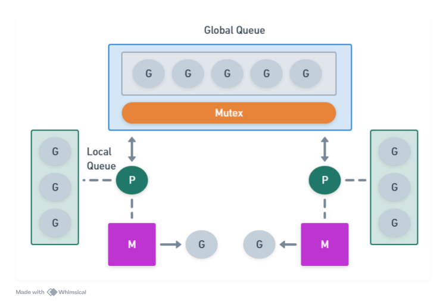
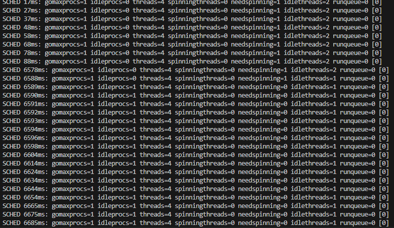

# Go Runtime Architecture

## Introduction

The Go runtime is the core of the Go programming language. It all code that manages the execution of Go programs. It is responsible for managing memory allocation, garbage collection, stack management, goroutine scheduling, and more.

## Components

- **Go Routines**: Go Routines are lightweight threads managed by the Go runtime. They are used to execute functions concurrently.
- **Scheduler**: The scheduler is responsible for managing the execution of go routines on the available CPUs.
- **Channels**: Channels are used to communicate between go routines.
- **Memory Allocator**: The memory allocator is responsible for managing memory allocation and garbage collection.
- **Garbage Collector**: The garbage collector is responsible for freeing up memory that is no longer in use.
- **Stack Management**: The stack management is responsible for managing the stack of each go routine.
- **Network Poller**: The network poller is responsible for managing network I/O operations.
- **Reflection**: The reflection is responsible for providing runtime type information.

## M:N Model

First of all, we have virtual threads (M) and real threads (N).

Virtual threads are threads created by the Go runtime (go routines), and real threads are threads created by the operating system.

Go runtime creates a number of virtual threads and manages them by itself. Then, it's not necessary to call the OS to create a new thread every time we need to run a new go routine.

This approach allow us to save memory and time, because we don't need to create a new thread every time we need to run a new go routine.

## Go Routines

Go routines are lightweight threads managed by the Go runtime. They are used to execute functions concurrently.

Create a go routine is cheaper than create a new thread, just 2kb. They are  easier to manage (create and destroy) than threads.

Also, a go routine share the same memory heap with the Go Application than can access and modify some data. But, they have their own stack.

## M:P:G Model

M: Machine, P: Processor, G: Goroutine. This model is used by the Go runtime to manage the execution of go routines.


## GOMAXPROCS

The GOMAXPROCS environment variable is used to set the number of Processors (P) that can execute user-level Go code simultaneously. Remembering, a Processor (P) is coupled with a thread (M), one P per M.

By default, the Go runtime will use the number of CPUs available on the machine.

Go can create new threads (M) if the current threads are blocked by I/O operations, for example. A Processor (P) should never be idle, this means that we aren't using all the resources available.

## Scheduler

### What is the Scheduler?

Go runtime has your own scheduler that is responsible for managing how and when the tasks are executed on OS threads. He decides when and which go routine will run on which OS thread, avoiding that a thread is idle or overloaded.

It is in charge of managing the synchronization of the go routines, mutexes, race conditions, deadlocks, etc.

"The scheduler's job is to match up a G (the code to execute), an M (where to execute it), and a P (the rights and resources to execute it). When an M stops executing user Go code, for example by entering a system call, it returns its P to the idle P pool. In order to resume executing user Go code, for example on return from a system call, it must acquire a P from the idle pool."

<https://go.googlesource.com/go/+/refs/heads/dev.go2go/src/runtime/HACKING.md>

It means that the scheduler has a pool of Ps that are available to run the go routines. When a go routine is created, the scheduler assigns a P to it, and when the go routine is finished, the P is returned to the pool.

### How the Scheduler Works?

The scheduler is part of Go Runtime. It's works on a adaptive way, that means that it can change the number of Ps according to the number of CPUs available.

Its activities are:

- Assign a P to a go routine.
- Manage the concurrency of the go routines.
- Load balance the Go routines between the Ps.
- Manage the Ps pool.

Until Go 1.13, the scheduler works on a cooperative way. It means that the go routines need to yield the processor to the scheduler. But, from Go 1.14, the scheduler works on a preemptive way, that means that the scheduler can stop a go routine and run another one.

### Scheduler vs Goroutines

The scheduler is responsible for managing the state of the go routines to know when they are ready to run, when they are running, when they are blocked, and when should run other go routines.

List of states of a go routine:

- **Running**: The go routine is running on a P.
- **Runnable**: The go routine is ready to run, waiting for a P.
- **Not Runnable**: The go routine is blocked, waiting for some event like I/O operation, mutex, etc.

### Work Stealing

The Go runtime uses a work-stealing algorithm to balance the load between the Ps. When a P is idle, it can steal work (goroutines) from another P.

### Scheduler Dynamics

- **Mutex**: They prohibit that the same go routine run on multiple Ps.
- **Process**: They have your own local queue of go routines. They get more from the global queue when they run out of go routines or when they are idle and other Ps are busy.
- **Machine**: A P is associated with a M. The M is responsible for running the go routines on the P.



### Testing the Scheduler

First, set:

- GOMAXPROCS=1. This will force the Go runtime to use only one P.
- GODEBUG=schedtrace=1. This will enable the scheduler trace.

Install go-wrk:

```bash
go install github.com/tsliwowicz/go-wrk@latest
```

and run the main.go file.

```bash
GOMAXPROCS=1 GODEBUG=schedtrace=1 go run main.go
```

The output will show the scheduler trace.



Structure:

- SHED: (how many time this scheduler is running)
- gomaxprocs: total of Ps
- idleprocs: total of idle Ps
- threads: total of routines generated by the go runtime
  - The go runtime create routine to manage run the main project, execute its garbage collector, etc.
- spinningthreads: total of routines up running something or waiting to be used
- needspinning: total of routines that will take a time to finish, then should be sent to spinningthreads
- idlethreads: total of idle threads
- runqueue: total of go routines that are ready to run, global queue. And after, the local queue of each P.

Run go-wrk to test the scheduler.

```bash
go-wrk -c 20 -d 100000 http://localhost:8080/leak
```

Running the command above, we can see that the scheduler is working and our global queue is increasing.
When it happens, means that we need more Ps to run the go routines or we have leak in our code.

## Preemption in Go

Preemption is the act of temporarily interrupting a task being carried out by a computer system, without requiring its cooperation, and with the intention of resuming the task at a later time.

In Go, preemption is used to stop a go routine and run another one. It's used to avoid that a go routine run forever and block the execution of other go routines.

We have some preemption sinais:

- **System Level**: Go add preemption points using OS resources. (Ex: signals)
  - Go verify point where the go routine can be stopped. This is located in the function that are called often/loops.
- **Long Running Functions**: Go runtime can stop a go routine that is running for a long time.
