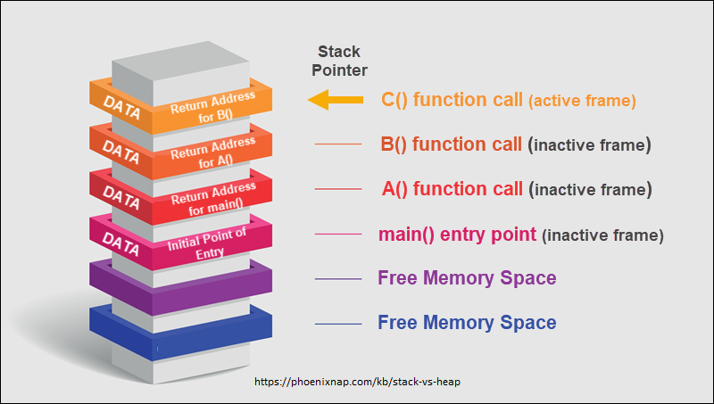
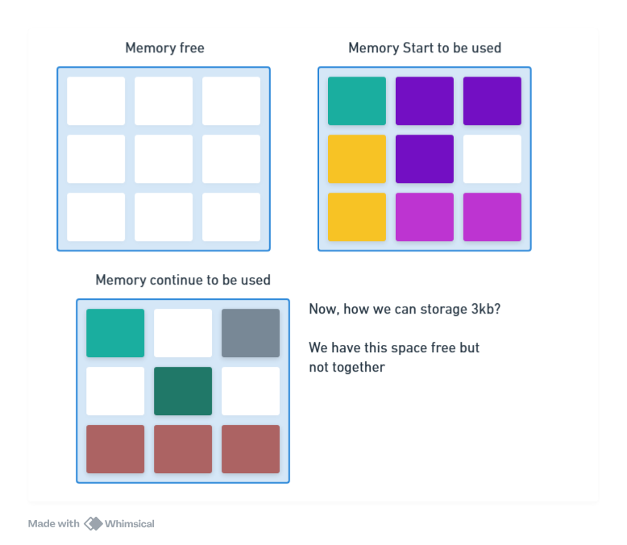

# Memory Management

## Basic Concepts

### Types of Memory

#### **Fast Access Memory**

This kind of memory is located in the same chip as the CPU and is used as a cache to store data that is frequently accessed by the CPU

- **L1** - 64kb
- **L2** - 0.5mb
- **L3** - 8mb

#### **Slow Access Memory**

Common memory sticks (DDR - Double Data Rate). This memory is connected to the CPU through the memory bus.

## How Operating Systems Manage Memory

When a process starts, the OS allocates a block of memory for it, called virtual memory. This approach isolates the process from the rest of the system, so each process has its own memory space.

However, when this process check how much memory it has, it will see that it has access to the entire memory of the computer, not only the block that was allocated to it.

Then, what happens if the process tries to access memory that was not allocated to it?

The OS can see and kill idle processes, it to do that when a process needs more memory and have no more free space.

## Memory Costs

### Threads

Threads takes up less memory than processes, because they share the same memory space. But, each thread has its own stack, which is a memory space that is used to store local variables and function calls.

A thread cost ~= 2mb (linux), even if it is not doing anything. (Expensive)

## How works

- **Stack**: Local variables and function calls, used by the compiler.
- **Heap**: Memory that is dynamically allocated by the program, used by the developer.
- Process starts:
  - **Static Data**: Variables that are declared outside of functions.
  - **Literals**: Strings and numbers that are hardcoded in the program.
  - **Instructions**: The code itself.

### Stack

The function calls are stored in the stack, so when a function is called, the program pushes the function call to the stack, and when the function returns, the program pops the function call from the stack.

- **LIFO**: Last In, First Out
- **Push**: Add a new element to the stack
- **Pop**: Remove the last element from the stack

### Heap

The heap is used to store data that is dynamically allocated by the program. A large memory pool is allocated by the OS, and the program can request memory from this pool being more flexible.

This memory can allocate a address for a action, deallocate it, and allocate it again for other action.

Complex data structures like linked lists, trees, and graphs are stored in the heap because they can grow and shrink as needed in runtime. For this reason, heap is slower than stack.

Developers are responsible for managing the memory in the heap, so they need to deallocate the memory when it is no longer needed.

### Memory Leaks

When a program allocates memory in the heap and forgets to deallocate it, it causes a memory leak. This can lead to the program running out of memory and crashing.

### Fragmentation

When the program allocates and deallocates memory in the heap, it can cause fragmentation. This happens when the memory is not contiguous, so the program cannot allocate a large block of memory even if there is enough free space.

#### Ar

### Concurrent Access

Thread have your onw stack, but can access the same heap. So, when two threads can access the same memory address.

We need to be careful when we are working with threads, because we can have race conditions, deadlocks, and other problems.
