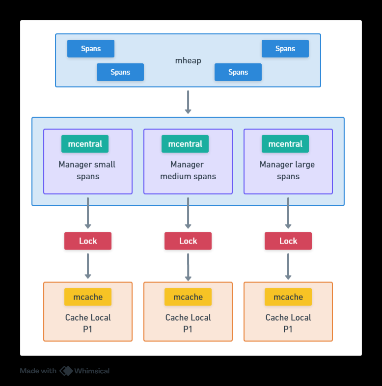

# Go Memory Management

The Go language use as base the TCMalloc, a memory allocator developed by Google. This allocator is optimized for multi-threaded applications, so it is very efficient for Go programs.

As time goes by, the Go team has been improving the memory management and now the own Go Runtime is in charge of managing the memory. Go memory allocator is called `mallocgc`.

## Mallocgc

The `mallocgc` is a memory allocator that is used by the Go Runtime to manage the memory. It is a garbage collector that is responsible for allocating and deallocating memory in the heap.

It separates the objects in three groups:

- **Tiny**: Objects that are smaller than 16 bytes.
- **Small**: Objects that are between 16 and 32 bytes.
- **Large**: Objects that are larger than 32 bytes.

It avoids always requesting memory from the OS, so it uses a memory pool to store the objects that are allocated in the heap.

When needs memory:
Goroutine -> Processor -> mcaches -> mcentral -> mheap -> OS

### Spans

Spans are memory blocks that are used to store the objects and can be tiny, small, or large. The spans are managed by the Mcentral.

### Mheap

Mheap is the memory pool that is used to store the objects that are allocated in the heap. It is responsible for requesting memory from the OS.

### Mcentral

Mcentral takes care of the spans that are used to store objects of the same size. It is responsible for managing the spans, being not necessary to request a new span from the OS every time that is necessary to allocate memory.

### Mcache

Mcache is a local cache used by P's. First, the P tries to allocate memory from the Mcache, and if it is not possible, the P requests a span from the Mcentral.

## Garbage Collector

Garbage Collector is a mechanism that is responsible for freeing the memory that is not being used by the program. This mechanism is used to avoid memory leaks and to improve the performance of the program.

How the Go Garbage Collector works:

- **non-generational**: Consider all objects in the heap as the same generation, without distinguishing between young and old objects.
- **concurrent**: Run concurrently with the application, so it does not stop the execution of the program.
- **tricolor**: Uses a tricolor algorithm to determine which objects are reachable and which are not.
