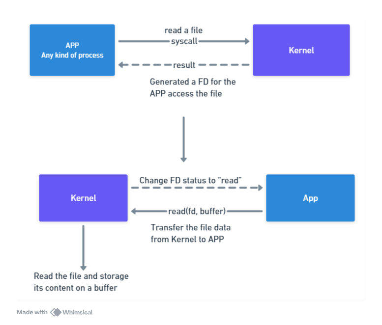
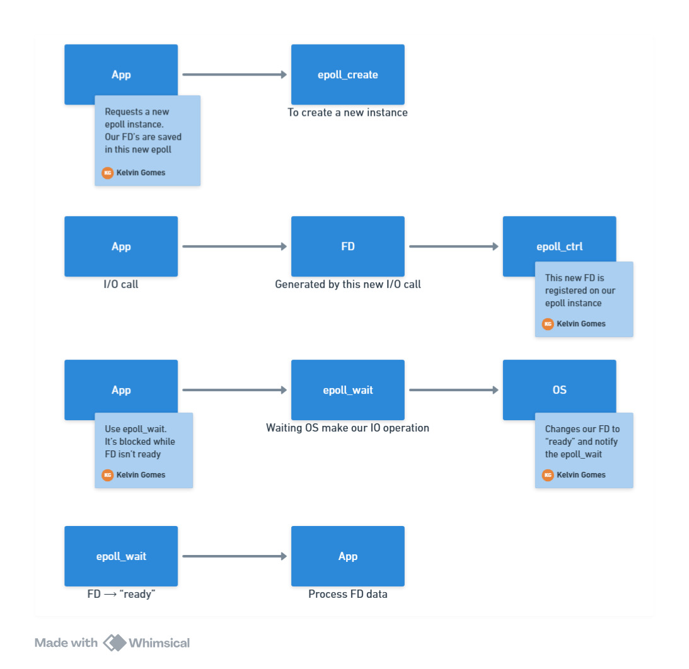
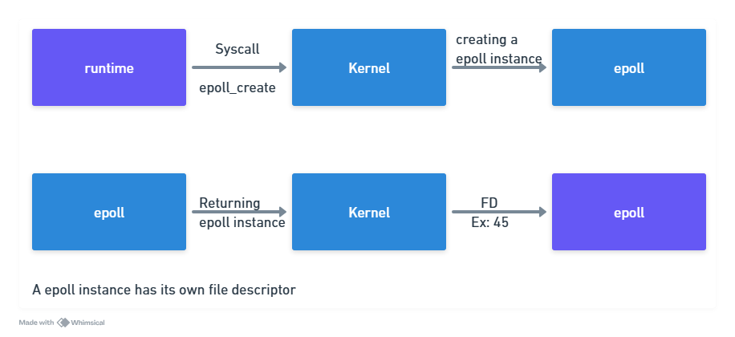
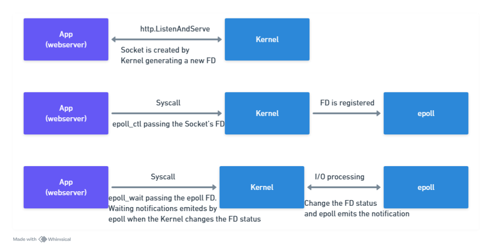
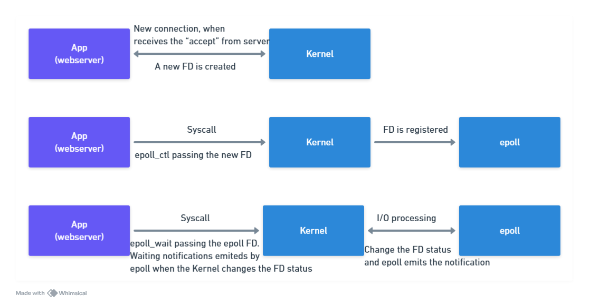

# Network Poller

## Concepts

### File Descriptor (FD)

- It is a unique identifier that the operating system assigns to access files, network sockets, and other I/O resources.
- It is an integer associated with an I/O resource and is used to realize operations like read, write, events, etc.
- There are some types of FDs:
  - **Standard FDs:**
    - 0: Standard input (stdin)
    - 1: Standard output (stdout)
    - 2: Standard error (stderr)
  - **User FDs:**
    - User FDs are created by the user and are used to access files, network sockets, etc.
- **Status of FDs:**
  - **Readable:** Data is available to read - (EPOLLIN)
  - **Writable:** Data can be written - (EPOLLOUT)
  - **Error:** An error occurred - (EPOLLERR)
  - **Hangup:** The connection is closed - (EPOLLHUP)
  - **Priority Read:** High-priority data is available to read - (EPOLLPRI)
  - **Edge Triggered:** The event is triggered only once - (EPOLLET)

### I/O Multiplexing

When the Kernel change the status of a file descriptor, it does not notify the APP directly. The APP needs to check the status of the FDs to know if there is any change. This is called I/O Multiplexing.

I/O Multiplexing monitoring multiple file descriptors, verifies which of them are ready for I/O operations without blocking the process. It allows the process to perform other tasks while waiting for I/O operations.

A unique process can monitor multiple file descriptors using I/O Multiplexing. It is more efficient than using multiple threads to monitor multiple file descriptors.

#### Types of I/O Multiplexing

- **select:** It is the oldest I/O Multiplexing mechanism. It is a system call that monitors multiple file descriptors. It is not scalable and has some limitations.
- **poll:** It is an improved version of the select system call. It monitors multiple file descriptors and is more scalable than select.
- **epoll:** It is the most efficient I/O Multiplexing mechanism. It allows monitoring multiple file descriptors. Event Oriented, emits events when the status of a file descriptor changes.
- **kqueue:** It is the most efficient I/O Multiplexing mechanism on BSD systems. Similar to epoll, plus it can monitor other types of events, like signals and timers.
- **IOCP:** It is the most efficient I/O Multiplexing mechanism on Windows systems. "IO Completion Ports", it have a different approach than the other mechanisms. There are no needs to monitor file descriptors, the system notifies the APP when an I/O operation is completed.

## What is Network Poller?

The Network Poller is a program that monitors multiple network asynchronous events. It uses the OS I/O Multiplexing mechanism to monitor multiple network sockets. When an event occurs, the Network Poller emits an event to the APP.

The Goroutines does not block while waiting for I/O operations, and it can be suspended while waiting for the I/O operation to complete.

## Epoll

Epoll is the most efficient I/O Multiplexing mechanism on Linux systems that can afford millions of simultaneously connections. It is used to monitor multiple file descriptors, and it is event-oriented. It emits events when the status of a file descriptor changes.

This approach is more efficient than the other I/O Multiplexing mechanisms because our app does not need to check the status of the file descriptors often (busy waiting).

### Where Epoll is used?

- **Network Poller:** Monitor multiple network sockets.
- **Asynchronous Services:** Processes that need to monitor multiple file descriptors.
- **Low Latency Apps:** Apps that need high performance on I/O operations.

#### Epoll Dynamic

#### GO and Epoll

#### Web Server Example

- Socket FDs wait for new connections.
- When a client tries to connect, the Kernel receives the connection and changes the status of the FD to ready.
- epoll_wait notifies the socket FD, allowing the APP to accept the connection.
- While there is no data to read, the APP is suspended, not consuming CPU resources.

- Go runtime dispatches a Goroutine to handle the request.

### Observations

- Go avoids make system calls to the Kernel when are doing the "epoll_wait" operation.
- The epoll_wait is configured as a buffer of events, to receive multiple FDs.
- When the runtime execute epoll_wait, it does not process only one event, it processes all events in the buffer.
- In the majority of cases, the "wait" returns a batch of FDs "ready".
